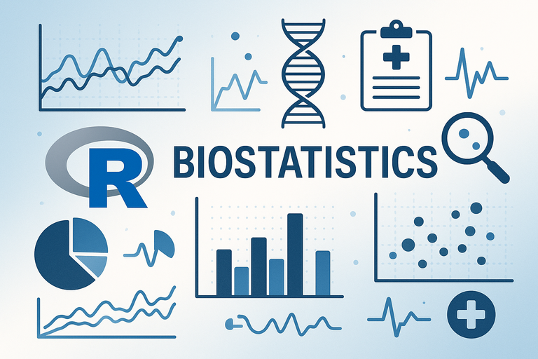
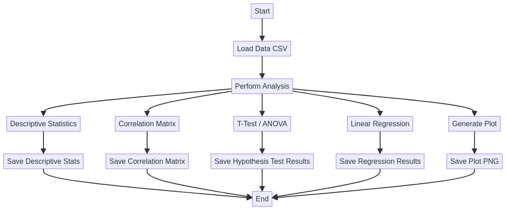
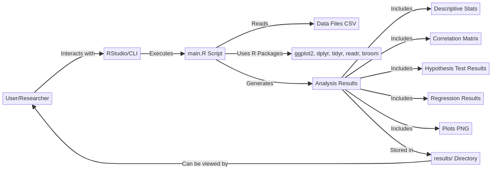

# Biostatistics-Research-Platform-R


## 🖼️ Imagem Hero



## English

### Overview

This repository, **Biostatistics-Research-Platform-R**, provides a robust and professional R-based platform for advanced biostatistical analysis. It is designed to handle various statistical tasks, including descriptive statistics, correlation analysis, t-tests, ANOVA, and linear regression, with integrated data loading, processing, and visualization capabilities. The platform emphasizes clean code, reproducibility, and ease of use for researchers and data scientists.

### Features

*   **Data Loading**: Supports CSV file input for flexible data integration.
*   **Descriptive Statistics**: Calculates mean, standard deviation, and median for numerical variables.
*   **Correlation Analysis**: Computes correlation matrices for numerical datasets.
*   **Hypothesis Testing**: Includes implementations for t-tests and ANOVA for group comparisons.
*   **Regression Analysis**: Performs linear regression for modeling relationships between variables.
*   **Data Visualization**: Generates informative scatter plots with regression lines using `ggplot2`.
*   **Structured Output**: Saves all analysis results (statistics, correlations, plots) into a designated output directory.
*   **Command-Line Interface (CLI)**: Easily execute analyses with specified input data and output paths.

### Project Structure

```
Biostatistics-Research-Platform-R/
├── .github/              # GitHub specific configurations (e.g., workflows, GitHub Pages)
│   └── workflows/        # GitHub Actions workflows
│       └── r-ci.yml      # Continuous Integration workflow for R
├── data/                 # Sample data files
│   └── sample_data.csv
├── docs/                 # Additional documentation and reports
├── results/              # Output directory for analysis results
├── src/                  # Source code for the biostatistics platform
│   └── main.R
├── tests/                # Unit and functional tests
│   ├── test_main.R       # Script to run main analysis for testing
│   └── testthat.R        # Unit tests using the testthat framework
├── CODE_OF_CONDUCT.md    # Code of Conduct for the project community
├── CONTRIBUTING.md       # Guidelines for contributing to the project
├── LICENSE               # Project license file
├── README.md             # Project README file (this file)
└── .Rprofile             # R environment configuration
```

### Workflow Diagram



### Architecture Diagram



### Installation

1.  **Clone the repository:**
    ```bash
    git clone https://github.com/galafis/Biostatistics-Research-Platform-R.git
    cd Biostatistics-Research-Platform-R
    ```
2.  **Install R and R packages:**
    Ensure you have R installed. Then, install the required R packages by running the following command in an R console:
    ```R
    install.packages(c("ggplot2", "dplyr", "tidyr", "readr", "broom", "testthat"), repos="http://cran.us.r-project.org", lib="~/R/library")
    ```

### Usage

#### Command Line Interface (CLI)

To run an analysis from the command line, use `Rscript`:

```bash
Rscript src/main.R --input data/sample_data.csv --output results
```

*   `--input`: Path to your input CSV data file.
*   `--output`: Directory where results will be saved. If it doesn't exist, it will be created.

#### Interactive Mode

You can also run the script interactively within an R environment. If no command-line arguments are provided, the script will generate sample data and perform an analysis, saving results to `results_interactive/`.

```R
source("src/main.R")
# The script will automatically run with sample data if no arguments are passed.
# To use your own data interactively:
# my_data <- load_data("path/to/your/data.csv")
# my_results <- perform_analysis(my_data)
# save_results(my_results, "my_output_directory")
```

### Tests

Unit tests are available in the `tests/` directory. To run them:

```bash
cd Biostatistics-Research-Platform-R
Rscript -e "library(testthat); test_dir(\"tests\")"
```

This will execute the tests defined in the `tests/` directory, which include `test_main.R` and `testthat.R`.

### Author

**Gabriel Demetrios Lafis**

---

## Português

### Visão Geral

Este repositório, **Biostatistics-Research-Platform-R**, oferece uma plataforma robusta e profissional baseada em R para análise bioestatística avançada. Ele foi projetado para lidar com várias tarefas estatísticas, incluindo estatísticas descritivas, análise de correlação, testes t, ANOVA e regressão linear, com recursos integrados de carregamento, processamento e visualização de dados. A plataforma enfatiza código limpo, reprodutibilidade e facilidade de uso para pesquisadores e cientistas de dados.

### Funcionalidades

*   **Carregamento de Dados**: Suporta entrada de arquivos CSV para integração flexível de dados.
*   **Estatísticas Descritivas**: Calcula média, desvio padrão e mediana para variáveis numéricas.
*   **Análise de Correlação**: Calcula matrizes de correlação para conjuntos de dados numéricos.
*   **Teste de Hipóteses**: Inclui implementações para testes t e ANOVA para comparações de grupos.
*   **Análise de Regressão**: Realiza regressão linear para modelar relações entre variáveis.
*   **Visualização de Dados**: Gera gráficos de dispersão informativos com linhas de regressão usando `ggplot2`.
*   **Saída Estruturada**: Salva todos os resultados da análise (estatísticas, correlações, gráficos) em um diretório de saída designado.
*   **Interface de Linha de Comando (CLI)**: Execute análises facilmente com dados de entrada e caminhos de saída especificados.

### Estrutura do Projeto

```
Biostatistics-Research-Platform-R/
├── .github/              # Configurações específicas do GitHub (ex: workflows, GitHub Pages)
│   └── workflows/        # Workflows do GitHub Actions
│       └── r-ci.yml      # Workflow de Integração Contínua para R
├── data/                 # Arquivos de dados de exemplo
│   └── sample_data.csv
├── docs/                 # Documentação e relatórios adicionais
├── results/              # Diretório de saída para os resultados da análise
├── src/                  # Código-fonte da plataforma de bioestatística
│   └── main.R
├── tests/                # Testes unitários e funcionais
│   ├── test_main.R       # Script para executar a análise principal para testes
│   └── testthat.R        # Testes unitários usando o framework testthat
├── CODE_OF_CONDUCT.md    # Código de Conduta para a comunidade do projeto
├── CONTRIBUTING.md       # Diretrizes para contribuir com o projeto
├── LICENSE               # Arquivo de licença do projeto
├── README.md             # Arquivo README do projeto (este arquivo)
└── .Rprofile             # Configuração do ambiente R
```

### Diagrama de Fluxo de Trabalho


### Diagrama de Arquitetura


### Instalação

1.  **Clone o repositório:**
    ```bash
    git clone https://github.com/galafis/Biostatistics-Research-Platform-R.git
    cd Biostatistics-Research-Platform-R
    ```
2.  **Instale R e os pacotes R:**
    Certifique-se de ter o R instalado. Em seguida, instale os pacotes R necessários executando o seguinte comando em um console R:
    ```R
    install.packages(c("ggplot2", "dplyr", "tidyr", "readr", "broom", "testthat"), repos="http://cran.us.r-project.org", lib="~/R/library")
    ```

### Uso

#### Interface de Linha de Comando (CLI)

Para executar uma análise a partir da linha de comando, use `Rscript`:

```bash
Rscript src/main.R --input data/sample_data.csv --output results
```

*   `--input`: Caminho para o seu arquivo de dados CSV de entrada.
*   `--output`: Diretório onde os resultados serão salvos. Se não existir, será criado.

#### Modo Interativo

Você também pode executar o script interativamente em um ambiente R. Se nenhum argumento de linha de comando for fornecido, o script gerará dados de exemplo e realizará uma análise, salvando os resultados em `results_interactive/`.

```R
source("src/main.R")
# O script será executado automaticamente com dados de exemplo se nenhum argumento for passado.
# Para usar seus próprios dados interativamente:
# my_data <- load_data("path/to/your/data.csv")
# my_results <- perform_analysis(my_data)
# save_results(my_results, "my_output_directory")
```

### Testes

Testes unitários estão disponíveis no diretório `tests/`. Para executá-los:

```bash
cd Biostatistics-Research-Platform-R
Rscript -e "library(testthat); test_dir(\"tests\")"
```

Isso executará os testes definidos no diretório `tests/`, que incluem `test_main.R` e `testthat.R`.

### Autor

**Gabriel Demetrios Lafis**

